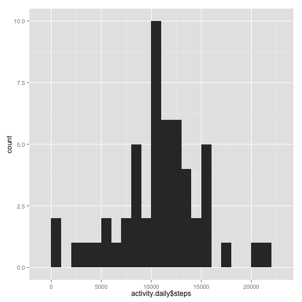
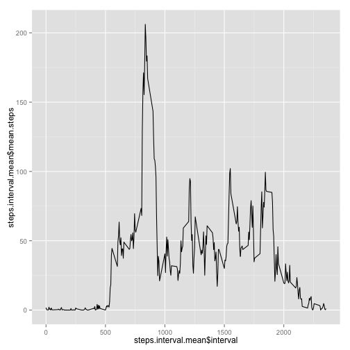
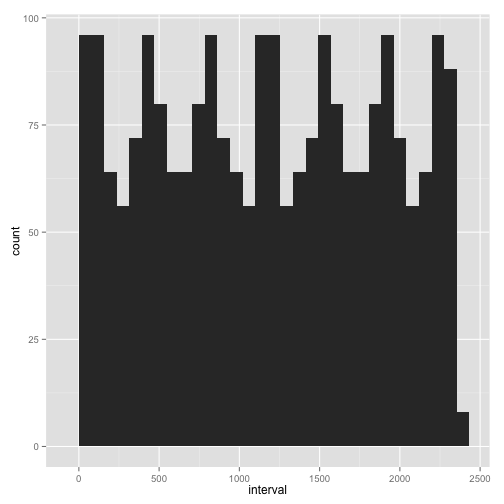
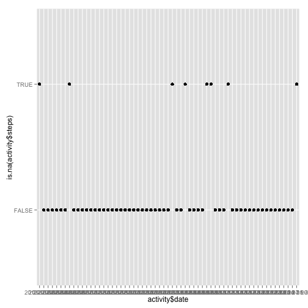
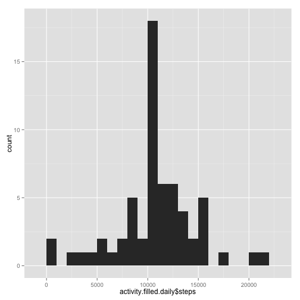
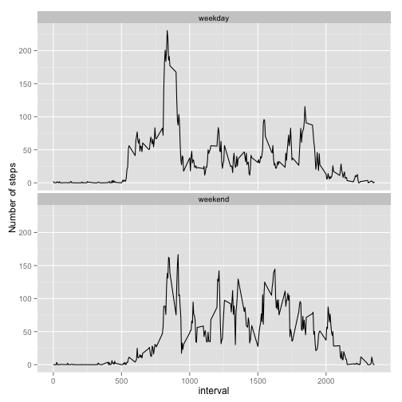

# Reproducible Research: Peer Assessment 1


```r
library(ggplot2)
```

## Loading and preprocessing the data


```r
activity <- read.csv(unzip('activity.zip'))
```


## What is mean total number of steps taken per day?


```r
# Aggregate daily data in a new DataFrame
activity.daily <- data.frame(rowsum(activity$steps, activity$date))
names(activity.daily) <- c('steps')

qplot(activity.daily$steps, binwidth = 1000)  # Histogram
```

 

```r
steps.daily.mean <- mean(activity.daily$steps, na.rm = TRUE)
steps.daily.median <- median(activity.daily$steps, na.rm = TRUE)
```

This user's mean steps per day were 10766 and median steps per day were 10765.

*NOTE: It seems suspicious that the median and mean should be so close in this data set, but my eyeball inspection seems to confirm the fact. Strange...*

## What is the average daily activity pattern?


```r
# Aggregate average internal steps in a DataFrame
steps.interval.mean <- 
    aggregate(activity$steps, list(activity$interval), mean, na.rm = TRUE)
names(steps.interval.mean) <- c('interval', 'mean.steps')

# Plot average steps per interval across all days
qplot(steps.interval.mean$interval, 
      steps.interval.mean$mean.steps, 
      geom='line')
```

 

```r
# Find the maximum average interval
interval.max <- 
    steps.interval.mean[which.max(steps.interval.mean$mean.steps),1]
interval.mean.max <-
    steps.interval.mean[which.max(steps.interval.mean$mean.steps),2]
```

The maximum average steps in an interval is 206.1698 steps at 835 minutes.

## Imputing missing values


```r
num.na <- sum(is.na(activity$steps))  # Count NA values
with(subset(activity, is.na(steps)), qplot(interval))  # Look at NA spread
```

```
## stat_bin: binwidth defaulted to range/30. Use 'binwidth = x' to adjust this.
```

 

```r
qplot(activity$date, is.na(activity$steps))
```

 

There are 2304 NA values, and they appear to be pretty evenly spread throughout the day and they're concentrated on certain days. *In fact, the pattern is suspiciously symmetric.* So, we'll just use the average for a given interval for any NA.


```r
# Create a new version of the dataset with NA values filled with interval
# averages.
activity.filled <- merge(activity, steps.interval.mean, by='interval')
activity.filled$steps[is.na(activity.filled$steps)] <- 
    as.integer(activity.filled$mean.steps[is.na(activity.filled$steps)])

# Daily sum
activity.filled.daily <- 
    data.frame(rowsum(activity.filled$steps, activity.filled$date))
names(activity.filled.daily) <- c('steps')
qplot(activity.filled.daily$steps, binwidth = 1000)  # Histogram
```

 

```r
filled.steps.daily.mean <- mean(activity.filled.daily$steps, na.rm = TRUE)
filled.steps.daily.median <- median(activity.filled.daily$steps, na.rm = TRUE)
```

After filling in missing values based on the interval mean, this user's mean steps per day were 10749 and median steps per day were 10641.

Filling missing values with the interval averages seems to have pushed the median and mean down and further apart from one another.

## Are there differences in activity patterns between weekdays and weekends?


```r
wknddys <- c('Saturday', 'Sunday')
activity.filled$weekday <- weekdays(as.Date(activity.filled$date))
activity.filled$daytype <- 'weekday'
activity.filled$daytype[activity.filled$weekday %in% wknddys] <- 'weekend'
activity.filled$daytype <- as.factor(activity.filled$daytype)

steps.filled.interval <- 
    with(activity.filled, 
         aggregate(steps, list(daytype, interval), mean))
names(steps.filled.interval) <- c('daytype', 'interval', 'mean.steps')

p <- qplot(interval, 
           mean.steps, 
           data = steps.filled.interval, 
           geom = 'line', 
           ylab = 'Number of steps') 
p + facet_wrap(~ daytype, ncol=1)
```

 

